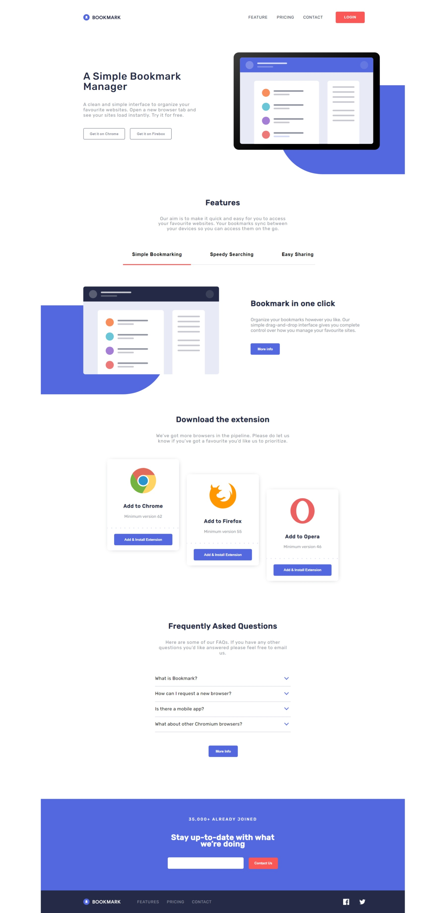

# Frontend Mentor - Bookmark landing page solution

This is a solution to the [Bookmark landing page challenge on Frontend Mentor](https://www.frontendmentor.io/challenges/bookmark-landing-page-5d0b588a9edda32581d29158). Frontend Mentor challenges help you improve your coding skills by building realistic projects. 

## Table of contents

- [Overview](#overview)
  - [The challenge](#the-challenge)
  - [Screenshot](#screenshot)
  - [Links](#links)
- [My process](#my-process)
  - [Built with](#built-with)
  - [What I learned](#what-i-learned)
  - [Continued development](#continued-development)
- [Author](#author)

## Overview

### The challenge

Users should be able to:

- View the optimal layout for the site depending on their device's screen size
- See hover states for all interactive elements on the page
- Receive an error message when the newsletter form is submitted if:
  - The input field is empty
  - The email address is not formatted correctly

### Screenshot

### Links

- Solution URL: [Add solution URL here](https://your-solution-url.com)
- Live Site URL: [Add live site URL here](https://your-live-site-url.com)

## My process

### Estimated time

8 hours

### Actual time

11 hours

### Built with

- Semantic HTML5 markup
- Flexbox
- CSS Grid
- [Vue](https://vuejs.org/) - Vue framework
- [SASS](https://sass-lang.com/)
- [Vite](https://vitejs-dev.translate.goog/?_x_tr_sl=en&_x_tr_tl=ru&_x_tr_hl=ru&_x_tr_pto=sc)

### What I learned

- How to work with SVG's fill and viewBox;
- Pass image's src correctly with Vue;
- Bind state's variables to style's properties;

- Reminded myself of how mixins work in SASS;

### Continued development

I'll stick to learning VUE. There is still a lot of info I don't know. In the closest future i want to develop app with API requests using VUE.
Also I want to create some more complicated animations using GSAP.

## Author

- Frontend Mentor - [@leqsar](https://www.frontendmentor.io/profile/yourusername)
